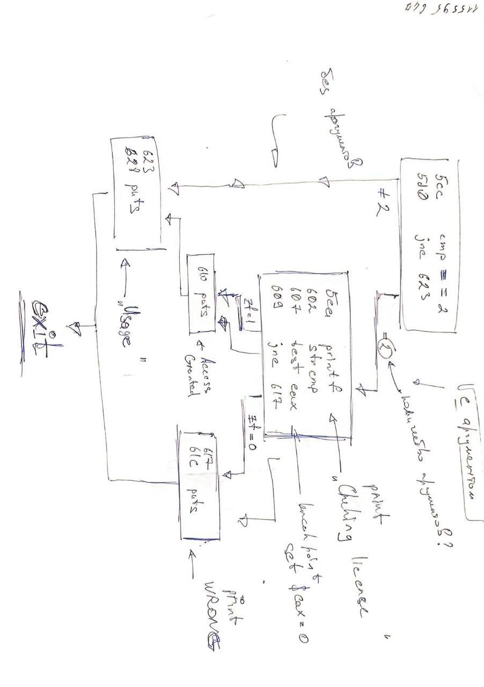

# Essentials

Сурс – https://youtube.com/playlist?list=PLhixgUqwRTjxglIswKp9mpkfPNfHkzyeN

Don't be a script kiddle!


### 0x01 Терминал

Ctrl + R – дает возможность искать в истории вводимых команд

| [ ll ] – это как ls, но с многими параметрами

| [ hexdump -C ] – посмотреть шестнадцатиричное наполнение файла с дублированием в ASCII в стоблце справа.

| [ env ] – переменные среды

| [ whereis ls ] – посмотреть, где находится утилита

**MAGIC**===================================================================

В общем. Если у тебя есть прога **./neo** в директории **/home/user_name/** то чтобы ее вызвать из другой директории нужно использовать полный путь до программы. Но. Что можно сделать.

| [ export PATH=$PATH:/home/user_name ] – вместо /home/user_name можно использовать другую директорию

И теперь можно вызывать программу просто как **neo**. Без полного пути! 

**END OF MAGIC**============================================================


### 0x02 C Programming

#### Гайд по vim

i – редактировать

o – редактировать на новой строке

Shift + o – редактировать на предыдущей строке

d + d – удалить строку

:w – сохранить

:q – **выйти** 

:syntax on – включить подсветку синтаксиса

:set number – включить нумерацию строк

Shift + g – переместиться вниз файла

```bash
vim -O file1 file2 # открытие файлов по-мексикански
```

Ctrl + w + → – переместиться на правый файл

! + ls – выполнить команду ls практически не выходя из vim

! + python + % – выполнить текущий файл в питоне

: set expandtab shiftwidth=4 softtabstop=4 – установить размер таба 4-мя пробелами


#### Гайд по C

1) Пример вывода ошибок

```c
fprintf(stderr, "Usage: %s <name>\n", argv[0]); // смотри как красиво можно делать
```

2) Аргументы

```bash
./matrix SomeWord
#arg[0]  arg[1]

./matrix SomeWord AnotherWord
#arg[0]  arg[1]   arg[2]

./matrix "SomeWord AnotherWord"
#arg[0]  arg[1]
```

3. Просмотр кода ошибки (после выполнения программы)

```bash
echo $? # отображает код ошибки последней выполненной команды или программы 
```

4. Переменные среды

```bash
./matrix $USER
# выведет Knock, Knock, Ilya

./matrix \$USER
# выведет Knock, Knock, $USER
```

5. Закинуть в автозагрузку

```bash
vim .bashrc
```

```properties
export PATH=$PATH:/home/$USER
matrix $USER
```

Остальное смотри в коде

**|	matrix.c**

```c
#include <stdio.h>

int main(int argc, char *argv[]){
        if(argc==2){
                printf("Knock, knock, %s\n", argv[1]);
        }else{
                fprintf(stderr, "Usage: %s <name>\n", argv[0]);
                return 1;
        }
        return 0;
}
```


### 0x03 Python

Несколько фактов о python.

print не требует переноса строки, но sys.stderr.write() требует.

#!/usr/bin/python2.7 – эта штука называется Shebang (почитай на википедии)

Остальное смотри в коде.

**|	matrix.py**

```python
#!/usr/bin/python2.7
import sys

if(len(sys.argv))==2:
    print("Knock, Knock, {0}".format(sys.argv[1]))
else:
    sys.stderr.write("Usage: {0} <name>\n".format(sys.argv[0]))
```


### 0x04 CPU

Немного ассемблера

[Полезный сурс](https://sockpuppet.org/issue-79-file-0xb-foxport-hht-hacking.txt.html)

[Тренировки](https://microcorruption.com/login)

```
rip = eip = instuction pointer = program counter = pc
rsp = esp = sp = stack pointer
jump - brunch - call = jmp - jne - je (equal)- jz (zero) - bne - call
jump 5 = mov eip, 5
```


### 0x05 Reversing & Cracking first simple program

#### Исходные данные

```bash
git clone https://github.com/LiveOverflow/liveoverflow_youtube.git
```

**|	Исходный код**

```properties
   0x00000000004005bd <+0>:     push   rbp
   0x00000000004005be <+1>:     mov    rbp,rsp
   0x00000000004005c1 <+4>:     sub    rsp,0x10
   0x00000000004005c5 <+8>:     mov    DWORD PTR [rbp-0x4],edi
   0x00000000004005c8 <+11>:    mov    QWORD PTR [rbp-0x10],rsi
   0x00000000004005cc <+15>:    cmp    DWORD PTR [rbp-0x4],0x2
   0x00000000004005d0 <+19>:    jne    0x400623 <main+102>
   0x00000000004005d2 <+21>:    mov    rax,QWORD PTR [rbp-0x10]
   0x00000000004005d6 <+25>:    add    rax,0x8
   0x00000000004005da <+29>:    mov    rax,QWORD PTR [rax]
   0x00000000004005dd <+32>:    mov    rsi,rax
   0x00000000004005e0 <+35>:    mov    edi,0x4006c4
   0x00000000004005e5 <+40>:    mov    eax,0x0
   0x00000000004005ea <+45>:    call   0x400490 <printf@plt>
   0x00000000004005ef <+50>:    mov    rax,QWORD PTR [rbp-0x10]
   0x00000000004005f3 <+54>:    add    rax,0x8
   0x00000000004005f7 <+58>:    mov    rax,QWORD PTR [rax]
   0x00000000004005fa <+61>:    mov    esi,0x4006da
   0x00000000004005ff <+66>:    mov    rdi,rax
   0x0000000000400602 <+69>:    call   0x4004b0 <strcmp@plt>
   0x0000000000400607 <+74>:    test   eax,eax
   0x0000000000400609 <+76>:    jne    0x400617 <main+90>
   0x000000000040060b <+78>:    mov    edi,0x4006ea
   0x0000000000400610 <+83>:    call   0x400480 <puts@plt>
   0x0000000000400615 <+88>:    jmp    0x40062d <main+112>
   0x0000000000400617 <+90>:    mov    edi,0x4006fa
   0x000000000040061c <+95>:    call   0x400480 <puts@plt>
   0x0000000000400621 <+100>:   jmp    0x40062d <main+112>
   0x0000000000400623 <+102>:   mov    edi,0x400701
   0x0000000000400628 <+107>:   call   0x400480 <puts@plt>
   0x000000000040062d <+112>:   mov    eax,0x0
   0x0000000000400632 <+117>:   leave  
   0x0000000000400633 <+118>:   ret
```


#### Анализ:

**|	Анализ на бумаге как в программе**



А вот и программы:

1) https://cutter.re/

2) https://www.hopperapp.com/

3) ida

4) https://github.com/radareorg/radare2

5) https://rada.re/

Заметки

```bash
(gdb) set disassembly-flavor intel # ты это уже видел
(gdb) si # следующая инструкция просто по порядку
(gdb) ni # перейти по следующей инструкции (скачки по jmp и т.д.)
(gdb) i r # важная вещь, не бойся использовать
(gdb) set $eip=0 # так можно
```


### 0x06 Simple Tools and Techniques for Reversing a binary

```bash
file * # посмотреть инфу про все файлы директории
hexdump -C file_name # очевидно
strings file_name # посмотреть какие строки в нем хранятся
objdump -d file_name # посмотреть весь деассемдлированный код
objdump -x file_name | less # посмотреть НЕ весь деассемблированный код программы
```

* .text – это код программы
* .rodata – это строки, которые ты видел в strings file_name

Во время декомпиляции момента проверки аргумента он заметил, что один из регистров (rsi) указывает на секцию .rodata. Просмотрев этот фрагмент можно понять, что именно там и находится нужный ключ.

```bash
man syscalls # важная штука посмотреть какие бывают системные вызовы
strace <program_path> args # смотрит какие системные выховы произошли в программе
ltrace <program_path> args # смотрит какие вызовы бибилиотек происходили
```


Ставим приблуды

```bash
git clone https://github.com/radareorg/radare2.git # мое мнение - cutter круче
cd radare2
./sys/install.sh # and wait
r2 <file_name> # анализировать программу
r2 -d <file_name> # дебажить программу
```

Команды r2

```bash
aaa # automaticly analyse and autoname function
afl # вывести все функции программы
? # если не знаешь что делать
s main # переместиться в main
pdf # вывести дизасемблированный код
VV # граф 
   # (переключать блоки Tab или Shift + Tab)
   # P – менять виды отображения
   # ? – мануал по графу
   # : – начать командовать (как в vim этом вашем)
   # R – цвета поменять (важное)
   # tab / Shift + tab – переключать элементы
   # afvn first_name second_name – переименовать переменную
   # p – показать адреса (в дебаг моде)
q # выйти
db 0x004005bd # поставить точку останова
dc # запустить программу
s # следующая команда
S # наверное типа с переходом по ссылкам
V! # "крутой" режим
```


### 0x07 Key validation with Algorithm and creating a Keygen

Команды r2

```bash
ood AAAA-WRONG-KEY # запустить прогу в режиме дебажинга с аргументов AAAA-WRONG-KEY
dc # запустить прогу в режиме дебага
db 0x0000121b # бахнуть точку останова
dr # посмотреть регистры
dr rip=0x0000121b # установить рип в это самое значение
s main # этого достаточно чтобы выйти из дебага

```

