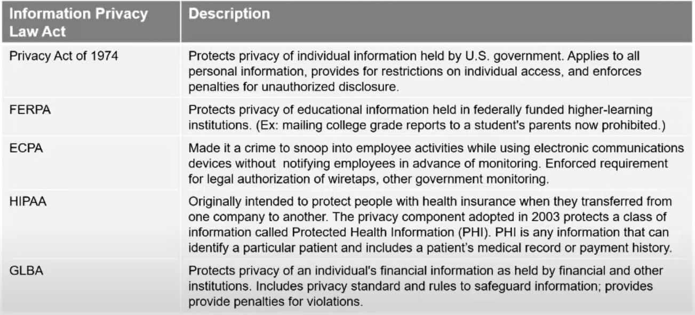
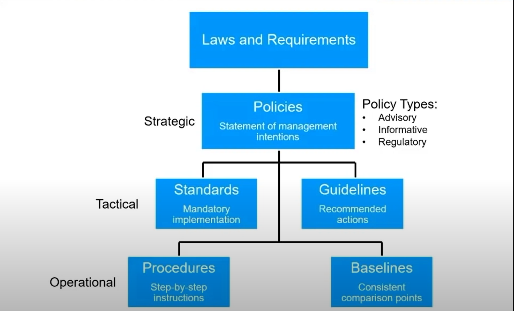
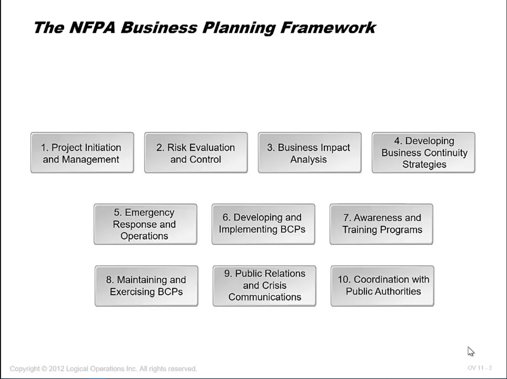
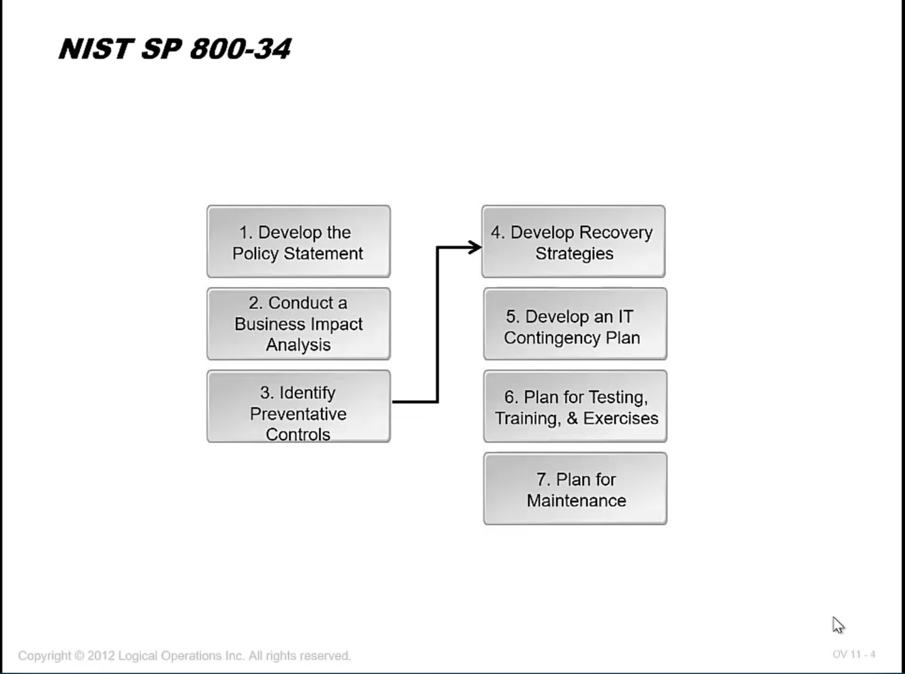
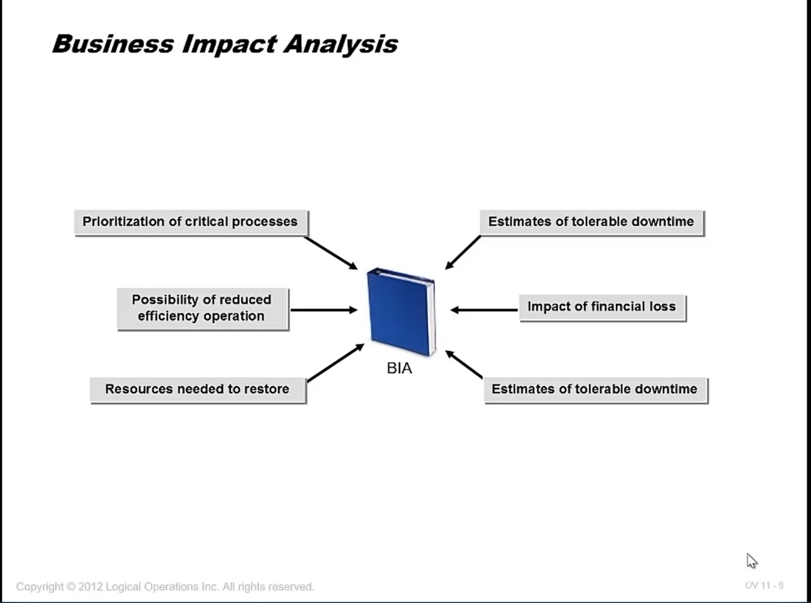
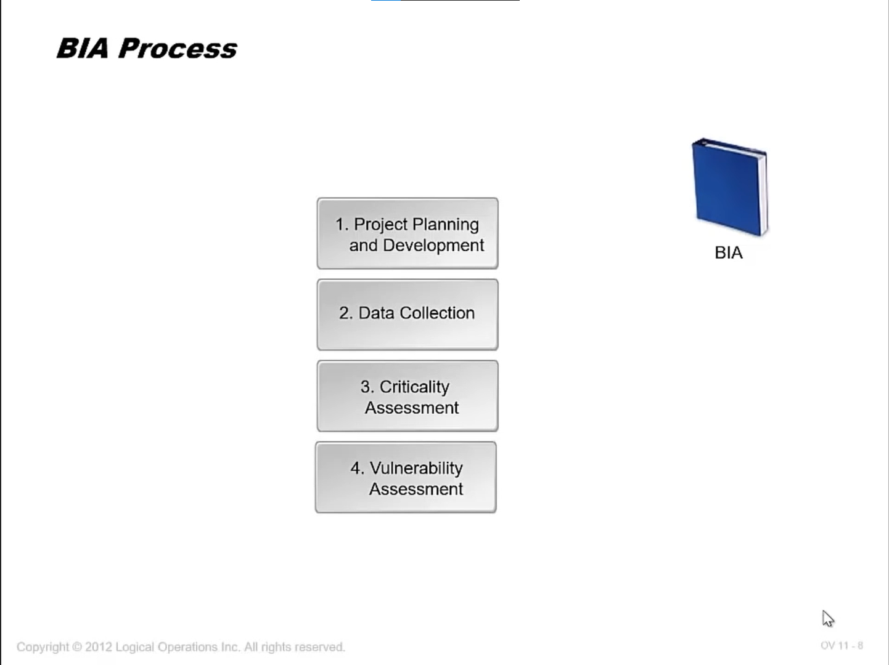
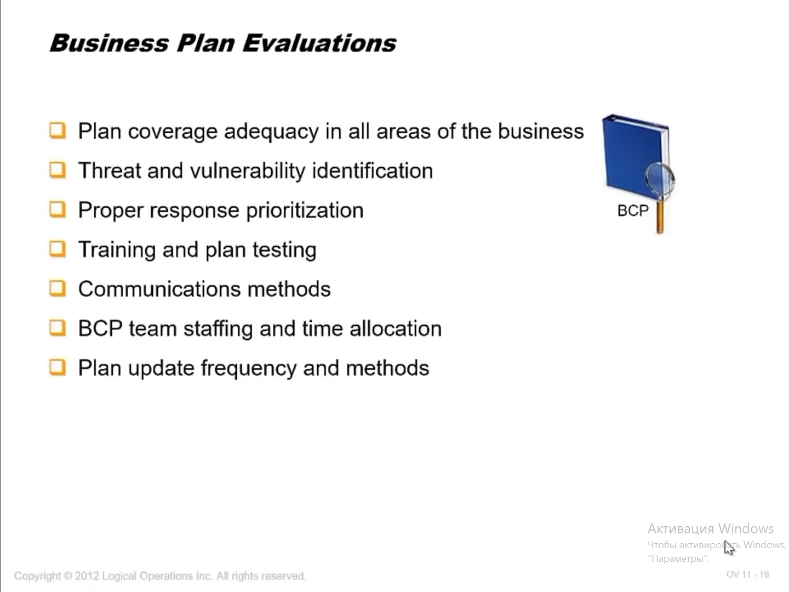
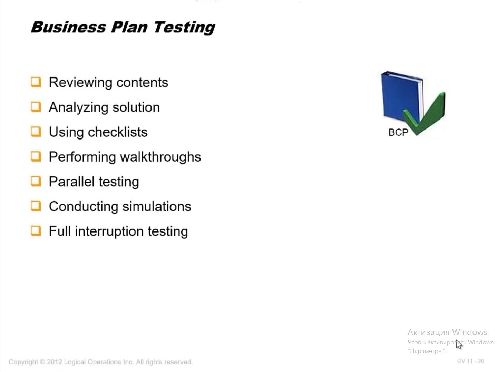
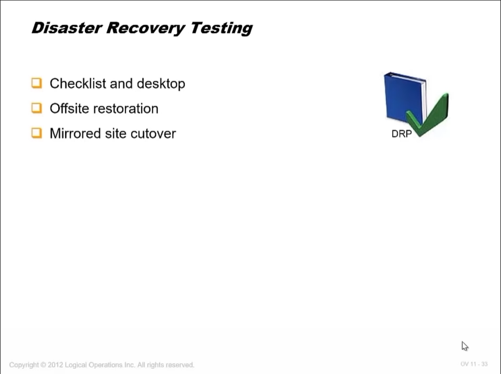
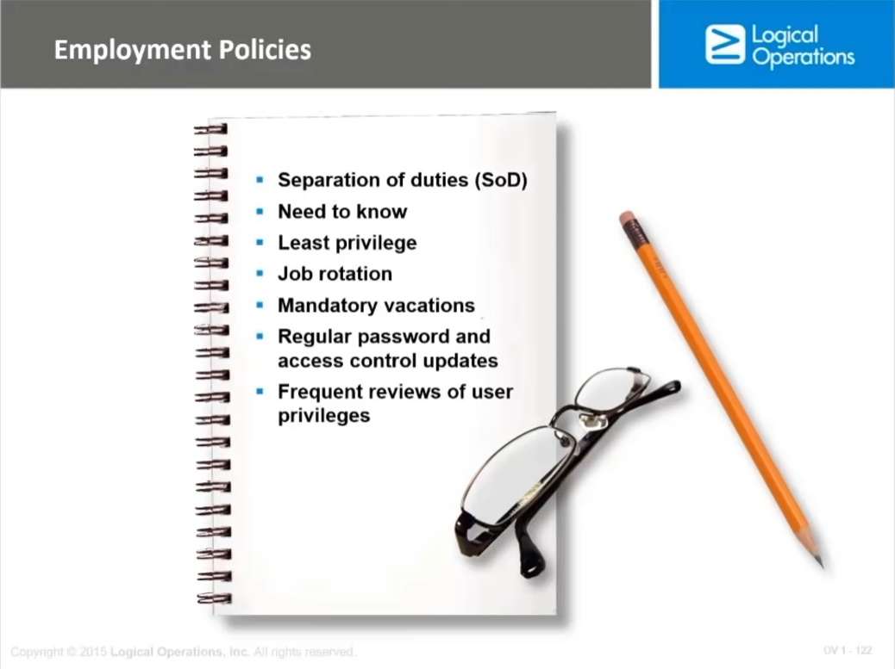

# CISSP Certification Course – PASS the Certified Information Security Professional Exam!

## Оглавление

Сурс – https://youtu.be/M1_v5HBVHWo

CISSP – Certified Information Systems Security Professional

[Книжки по CISSP](https://www.mhprofessional.com/catalogsearch/result/?q=CISSP)

### Части курса:

1. Управление рисками и безопасностью (security & risk management)
2. Безопасность активов (asset security)
3. Инженерная безопасность (security engineering)
4. Сетевая безопасность (communications & network security)
5. Управление доступом (identity and access management)
6. Аудит и тестирование безопасности (security assessment & testing)
7. Процедуры ИБ (security operation)
8. Безопасность разработки (software development security)

## Управление рисками

### 1. Части управления рисками:

1. Принципы иб гос учереждений
2. Комплайнс
3. Профессиональная этика
4. Документация
5. Управление рисками
6. Моделирование угроз
7. Основы плана обеспечения непрерывности бизнеса (business continuity plan fundamentals)
8. Cтратегия и практика приобретения (acquisition strategy and practice)
9. Политики безопасности
10. Информированность и тренинги (security awareness and training)

### 2. Нормативка США

**|	Список нормативных документов США**

### 3. Этика

Есть такая штука IAB (*internet architecture board of ethics*), ISOC (*Internet Society*) – общество интернета, IETF (*Internet Engineering Task Force*) – инженерный совет интернета.

А еще существует ISC2 (*The International Information System Security Certification Consortium*) Code of Ethics

Также существует RFC (*Request for Comments*) –  документ из серии пронумерованных информационных документов Интернета, содержащих технические спецификации и стандарты, широко применяемые во всемирной сети. 

RFC 1087 – Ethics and the Internet (см в отдельном файле)

### 4. Документация

5 типов документирования

| Тип документа | Описание                                                     |
| ------------- | ------------------------------------------------------------ |
| Policy        | Общее описание положения дел. Например, безопасность информации должна быть обеспечена реализацией лучших практик ИБ |
| Standatrt     | Что нужно сделать и каким способом Например, в организации должен быть реализован 802.1x для беспроводных сетей |
| Guideline     | Описание что КОНКРЕТНО нужно сделать Например, в случае выезда с рабочим ноутбуком вы должны придерживаться правил предосторожности для предотвращения кражи или поломки ноутбука |
| Procedure     | Пошаговое описание Например, для реализации SSH на роутере введите enable и введите команды |
| Baseline      | Минимальные системные требования Например, TFTP должен быть выключен на всех серверах, кроме непосредственно требующих его. |

**|	Структура документации**

Политики расписывают вообще все. На все есть политика. Хочешь удалить файл - посмотри политику, хочешь послать письмо - посмотри политику, хочешь уволить сотрудника за то, что он неправильно послал письмо - посмотри политику.

Есть шаблоны многих политик на разные тематики на сайте SANS. https://www.sans.org/information-security-policy/

Любая политика базируется на требованиях (типа ISO/IEC 27001:2013, PCIDSS).

### 5. Менеджмент рисков

Риск = Угроза * Уязвимость * Последствия

**Этапы анализа рисков**

1. Asset identification;
2. Vulnurability identification;
3. Threat assessment (оценка угроз);
4. Probability quantification;
5. Probability qualitification;
6. Financial impact evaluation (оценка финансового влияния);
7. Countermeasures determination (определение контрмер);

*Полезнаый стандарт AS/NZS 4360:2004: RISK MANAGEMENT.*

*Мысли шире. Например, менеджмент рисков затрагивает в том числе найм сотрудников и проверка таковых. В том числе составление NDA – non-disclosure agreements*

---

**4 принципа управления рисками:**

* Избегание;
* Смягчение;
* Принятие;
* Перенос.

$$ {Формулы для рассчета рисков:}
ФОРМУЛЫ\ ДЛЯ\ РАССЧЕТА\ РИСКОВ:\\\\
Asset\ Value\ (AV) = 100.000\\
Explosure\ Factor\ (EF) = 30\%\\
Single\ Lost\ Expectancy\ (SLE) = AV * EF = 30.000\\
Annual\ Rate\ Occurancy\ (ARO) = 1/5 = 0,2\\
Annual\ Lost\ Expectancy\ (ALE) = SLE * ARO = 6.000
$$

### 6. Непрерывность бизнеса

*термин:* BCP – Business Continuity Plan

*термин:* DRP – Disaster Recovery Plan

---

#### BCP

**|	Состав BCP**

**|	NIST SP 800-34 описывает BCP**

**|	Главный документ в BCP это Business Impact Analysis (BIA)**

**|	BIA процессы**

---

*Важной характеристикой BCP является MTD – maximum tolerable downtime.*

*Помимо этого есть RTO – recovery time objectives*

*MTTF – mean time to failure*

*MTTR – mean time to repair*

*MTBF – mean time betwin failures (Usefull life)*
$$ {Условие устойчивости бизнеса}
УСЛОВИЕ\ УСТОЙЧИВОСТИ\ БИЗНЕСА\\\\
RTO < MTD\\
MTBF = MTTF + MTTR
$$

---

**|	BP Evaluation**

**|	BP Testing**

#### DRP

DRP делится на 4 уровня документов:

1) short-term;
2) mid-term;
3) long-term;
4) not required.

*Например, DRP может быть стратегия ведения бэкапов.*

Важным аспектом DRP является назначения RTO – recovery team. Людей, которые знают, что делать при особой ситуации. (~Как же все это напоминает наше ОБЖ~)

**|	DR Testin**

### 7. Политика управления персоналом (Employment Policies)

**|	Состав политики**

