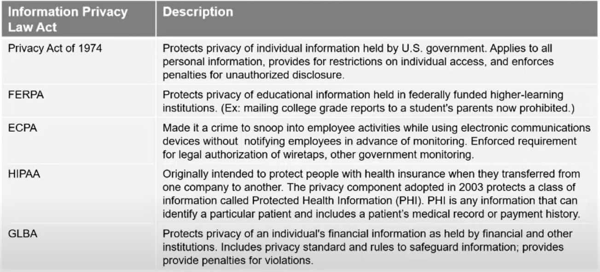

# CISSP Certification Course – PASS the Certified Information Security Professional Exam!

## База

Сурс – https://youtu.be/M1_v5HBVHWo

CISSP – Certified Information Systems Security Professional

##### Части курса:

1. Управление рисками и безопасностью (security & risk management)
2. Безопасность активов (asset security)
3. Инженерная безопасность (security engineering)
4. Сетевая безопасность (communications & network security)
5. Управление доступом (identity and access management)
6. Аудит и тестирование безопасности (security assessment & testing)
7. Процедуры ИБ (security operation)
8. Безопасность разработки (software development security)

---

## Управление рисками

##### Части управления рисками:

1. Принципы иб гос учереждений
2. Комплайнс
3. Профессиональная этика
4. Документация
5. Управление рисками
6. Моделирование угроз
7. Основы плана обеспечения непрерывности бизнеса (business continuity plan fundamentals)
8. Cтратегия и практика приобретения (acquisition strategy and practice)
9. Политики безопасности
10. Информированность и тренинги (security awareness and training)

##### Важные термины

1. CIA – confidentiality, integrity, availability (конфиденциальность, целостность, доступность);
2. Countermeasure – контрмера;
3. Measurement – измерение?;
4. Likelihood – веротность;
5. Requirements – требования;
6. Complience – соблюдение требований;
7. Due diligence – должная осмотрительность? (проверка слабостей, уязвимостей);
8. Assessment – оценка;
9. Awareness – информированность;
10. Adherence – соблюдение, приверженность;
11. Ensuring – обеспечение;
12. Implementation – реализация;
13. Senior management – высшее руководство;
14. Set forth by – установленние чего-то кем-то (например, норм правительством);
15. Impose – наложить (например, политики);
15. Personal identifieble information (PII) – ПДн;
15. Expose – раскрывать, разглашать;
15. Obviously – очевидно;
15. Treat – обрабатывать?;
15. Reliable – надежный?; 

##### Нормативка США

##### Этика

Есть такая штука IAB (*internet architecture board of ethics*), ISOC (*Internet Society*) – общество интернета, IETF (*Internet Engineering Task Force*) – инженерный совет интернета.

А еще существует ISC2 (*The International Information System Security Certification Consortium*) Code of Ethics

Также существует RFC (*Request for Comments*) –  документ из серии пронумерованных информационных документов Интернета, содержащих технические спецификации и стандарты, широко применяемые во всемирной сети. 

RFC 1087 – Ethics and the Internet (см в отдельном файле)

