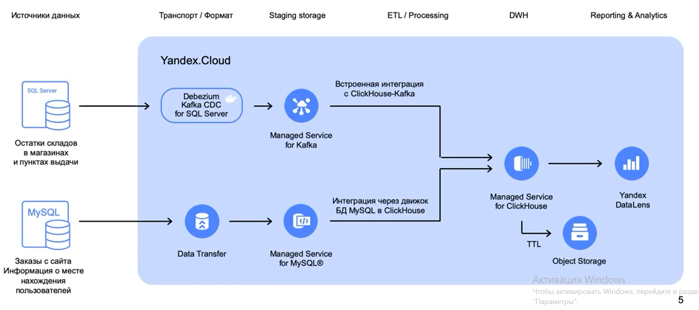
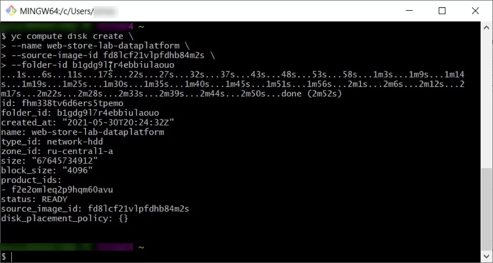
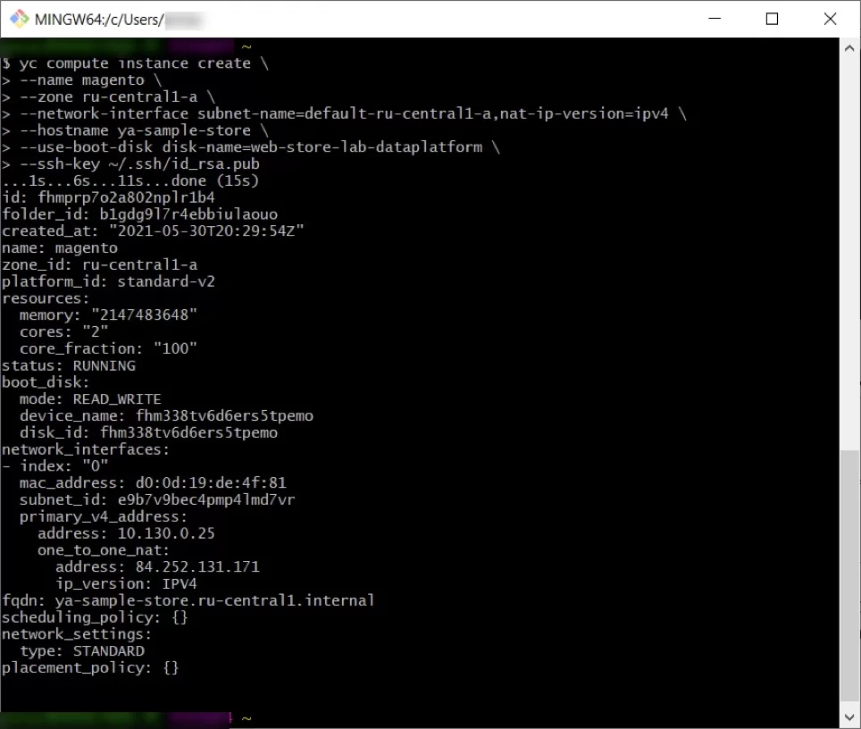

# Курс по построению аналитической платформы

Сурс – https://go.teachbase.ru/course_sessions/363773

**|	Архитектура рассматриваемой системы**




#### Настройка Yandex Data Transfer

MySQL базу разворачиваем на виртуалке вместе с интернет-магазином, подключаемся к базе по DBeaver (https://dbeaver.io/).

Создает Managed Service for MySQL, и Data Transfer для него.

В дата трансфере указывает источник, получатель, создает и активирует трансфер.

И все! 


##### Подробнее

###### Создаем виртуальную машину через CLI Яндекса

```bash
yc compute disk create \
--name web-store-lab-dataplatform \
--source-image-id fd8lcf21vlpfdhb84m2s \
--folder-id <your-yc-folder-id>
```

Получим примерно вот такую картинку




Продолжаем создавать машину (*Имя подсети возможно будет другим*)

```bash
yc compute instance create \
--name magento \
--zone ru-central1-a \
--network-interface subnet-name=default-ru-central1-a,nat-ip-version=ipv4 \
--hostname ya-sample-store \
--use-boot-disk disk-name=web-store-lab-dataplatform \
--ssh-key ~/.ssh/id_rsa.pub
```


Теперь получим примерно вот такую картинку




Для передачи данных по сети нам нужно настроить параметры группы безопасности. Для этого перейдите в параметры ВМ, раздел **Сеть** и кликните на ссылку с именем группы безопасности. Добавьте разрешение на входящий трафик с 80 и 443 порта, а также с порта MySQL 3306. Для исходящего трафика можно разрешить весь диапазон портов.


###### Подключаемся по ssh.

После этого

Проверим подключение к сайту с интернет-магазином.
Для того, чтобы можно было подключаться по прямой ссылке http://ya-sample-store.local, от имени администратора откройте файл hosts (C:\Windows\System32\drivers\etc\hosts — для Windows и /etc/hosts — для Linux) и добавьте строку:
<ip-address-vm> ya-sample-store.local

---

Для реплицирования таблиц с информацией о заказах интернет-магазина создадим кластер Managed Service for MySQL:

В консоли управления выберите каталог, в котором нужно создать кластер БД.
Выберите сервис Managed Service for MySQL и нажмите **Создать кластер**.
Задайте имя кластера — *ya-sample-cloud-mysql*.
Выберите класс хоста — s2.small (4 cores vCPU, 16ГБ).

В блоке **Размер хранилища**:
Выберите тип хранилища — network-ssd.
Выберите объем — 32ГБ.

В блоке **База данных**:
Укажите **имя базы данных** — *magento-cloud*.
Укажите **имя пользователя** — *yc-user* и пароль — *12345678*.
В блоке **Сетевые настройки** выберите облачную сеть для размещения кластера и группы безопасности для сетевого трафика кластера.

В блоке **Хосты** выберите параметры хостов БД, создаваемых вместе с кластером:
Зона доступности — ru-central1-a.
Подсеть — default-ru-central1-a.
Нажмите кнопку **Создать кластер**.

---

Чтобы синхронизировать информацию о заказах из БД MySQL интернет-сайта с промежуточным хранилищем данных, которое находится в облаке, настроим Data Transfer:

В консоли управления выберите каталог, в котором нужно создать конфигурацию для подключения.
Выберите сервис Data Transfer и нажмите **Создать эндпоинт**.

Определим параметры источника данных — виртуальной машины интернет-магазина с запущенным на нем экземпляром MySQL:
**Имя** — *magento-source*.
Выберите из списка **тип БД** — MySQL.
**IP хоста** — <публичный_IP-адрес_виртуальной_машины>.
**Имя базы данных** — *ya_sample_store*.
**Имя пользователя** — *magento-svc* и пароль — *m@gent0*.
В **белом списке** укажите префиксы таблиц, которые подлежат репликации, например, *sales_**.
Нажмите кнопку **Создать**.

Определим параметры приемника данных — управляемой базы данных Managed Service for MySQL, которая находится в облаке:
**Имя** — *magento-report-dest*.
**База данных** — Managed Service for MySQL.
Выберите из списка **идентификатор кластера** — *ya-sample-cloud-mysql*.
**Имя базы данных** — *magento-cloud*.
**Имя пользователя** репликации — *yc-user* и пароль — *12345678*.
В строке **Отключение проверки констрейнтов** поставьте галочку.
В данном случае, если произойдет нарушение порядка передачи данных, не будут выдаваться сообщения об ошибках.
Нажмите кнопку **Создать**.

---

Теперь создадим трансфер. Выберите в меню раздел Трансферы и нажмите кнопку **Создать трансфер**.

Определим параметры трансфера:
**Имя** — *sales-order-sync*.
В блоке **Источник** выберите эндпоинт — *magento-source*.
В блоке **Приемник** выберите эндпоинт — *magento-report-dest*.
В блоке **Тип трансфера** выберите — Копировать и реплицировать.
Нажмите кнопку **Создать**.

---

Нажмите на три точки в строке с описанием трансфера и выберите Активировать.
Будет выполнена первоначальная синхронизация схем данных и другой информации, а в дальнейшем, данные будут автоматически синхронизироваться при появлении изменений в базе данных источника. Статус синхронизации и сообщения об ошибках можно найти в разделе Логи.


###### Проверяем

Перейдите в раздел SQL стейджингового хранилища ya-sample-cloud-mysql.
Введите **имя пользователя** — *yc-user* и **пароль** — *12345678*.
Выберите БД — *magento-cloud*.
Нажмите **Подключиться**.


