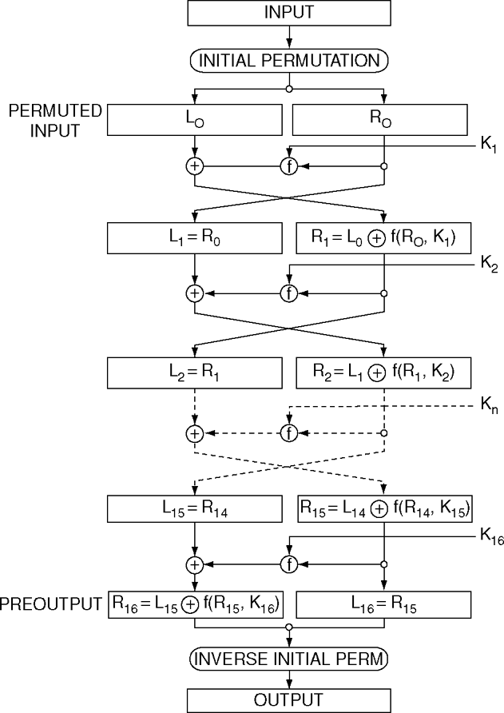

# Cryptography Algorithms

## История

### Великая (последняя) теорема Ферма

Теорема утверждает, что для любого n > 2 уравнение ниже не имеет решений в целых ненулевых числах a, b, c.

$$
a^n + b^n = c^n
$$

### Малая теорема Ферма

Если p – простое число и a – целове число, не делящееся на p, то уравнения ниже верны. Малая теорема Ферма используется для проверки чисел на простоту. Если числе удовлетворяют равенству, то они либо простые, либо псевдопростые.

$$
a^{p-1}≡1(mod\ p)
$$

$$
a^p ≡ a(mod\ p)
$$

### Последовательность Мерсенна

Последовательность чисел по формуле ниже. Идентификатор по OEIS A000043. [GIMPS](https://www.mersenne.org/) – гики, которые совместно эти числа ищут. Самое здоровое – M82589933 – 2 в степени 82,589,933

$$
M_n = 2^n-1
$$

### ROT13 (шифр Цезаря)

Это шифр Цезаря со сдвигом 13)) В декабре 1999 года было установлено, что Netscape Communicator использовал RОТ-13 в рамках небезопасной схемы для хранения паролей электронной почты.

### Криптограммы Бейла (книжный шифр)

Три зашифрованных сообщения, хранящих информацию о местонахождении клада. Второе было расшифровано с помощью Декларации независимости, остальные пока что не расшифрованы.

### Шифр Вернама (одноразовый блокнот)

Все просто – XOR с одноразовым случайным ключом длиной, равной длине открытого текста. Хороший шифр. Надежный. Пример  системы с абсолютной криптографической стойкостью.

Этот алгоритм использовался для красной линии между Вашингтоном и Москвой для шифрования сообщений между лидерами США и СССР во время холодной войны. Из актуальных реализаций – Hyper Crypto Satellite.

### Принцип Керкгоффса

"Криптосистема должна быть безопасной, даже если все о системе, кроме ключа, является общеизвестным". Вообще там было 6 требований, в целом сводящихся к этому принципу.

### Совершенная секрентость

Криптосистема может считаться обладающей совершенной секретностью, если она удовлетворяет как минимум двум условиям:

* Она не может быть взломана, даже если противник обладает неограниченной вычислительной мощностью.
* Невозможно получить какую-либо информацию о сообщении, [m], и ключе, [k], путем анализа криптограммы, [c] (то есть система Вернама является теоретически совершенной системой секретности, но только при определенных условиях).

## Симетричные ребята

### DES (Data Encryption Standard)

Принят в 1977. Блок - 64 бита.

