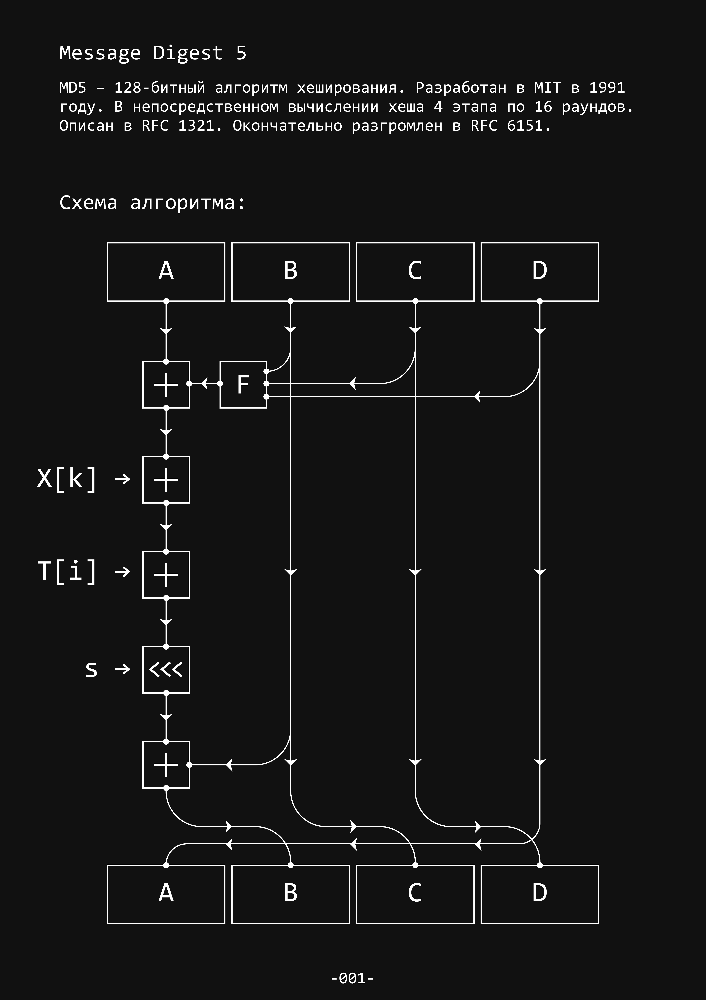

# Message Digest 5

MD5 – 128-битный алгоритм хеширования. Разработан в MIT в 1991 году. В непосредственном вычислении хеша 4 этапа по 16 раундов. Описан в RFC 1321. Окончательно разгромлен в RFC 6151.

**|	Схема алгоритма MD-5**

